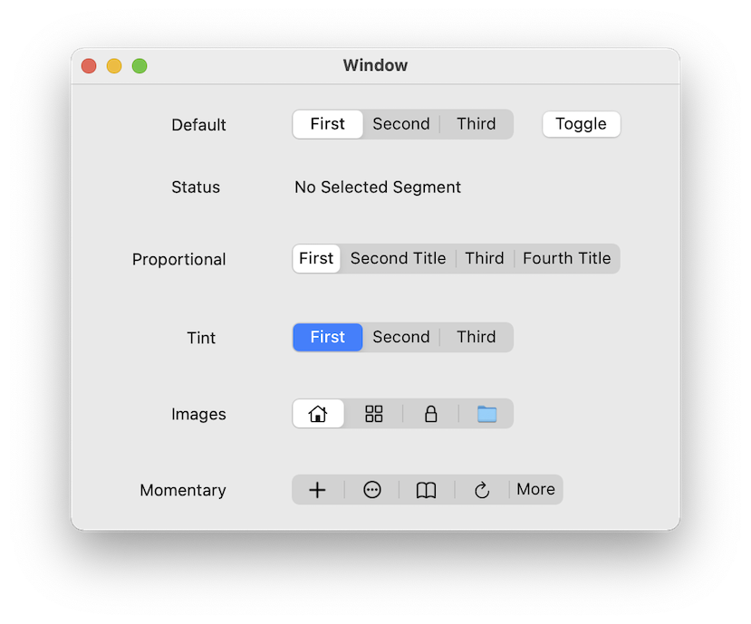
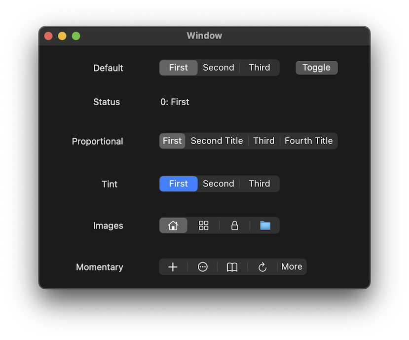

#  SegmentedControl

A Swift / AppKit segmented control for macOS based on UISegmentedControl.

## Features

- Supports title or image.
- Fixed or proportional segment layout.
- Fully animated appearance updates.
- Aqua and dark appearance.
- Tint color.

Requires macOS 10.15 or later.

## Screen Shots

